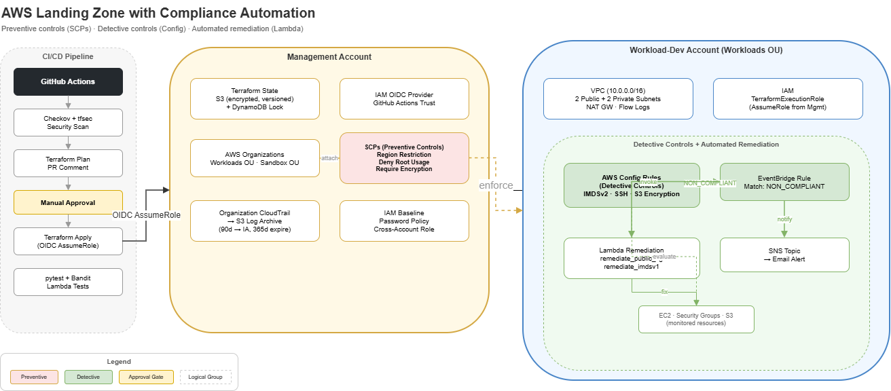

# AWS Landing Zone



A multi-account AWS Landing Zone built with Terraform and deployed via GitHub
Actions using OIDC.

### Architecture walkthrough

Two AWS accounts under one Organization. The management account
owns the Terraform state bucket, the GitHub OIDC provider,
the Organizations OUs and SCPs, and the organization-wide CloudTrail. The workload
account in the Workloads OU owns application resources which for this project include the AWS Config recorder,
the Config rules and the SNS topic.

GitHub Actions authenticates to AWS by exchanging a workflow OIDC token for
an IAM role session in the management account. From there, the workload
provider assumes `OrganizationAccountAccessRole` in the workload account.
Trust direction reads: GitHub repo -> management account OIDC role ->
workload account deploy role.

CloudTrail flows the other way. Every account in the Organization writes
audit events to the log archive bucket in the management account through
the org-wide trail. SCPs attached to the Workloads OU enforce region
restriction, deny root usage, and require encryption on EBS launches and S3
PutObject calls.

## What's in here

| Component | Purpose |
|---|---|
| `bootstrap/state` | S3 remote state bucket (versioned, AES256, S3 native locking) |
| `bootstrap/github-oidc` | GitHub OIDC provider + IAM role for CI |
| `modules/organization` | Workloads + Sandbox OUs and three SCPs (region restriction, deny root usage, require encryption) attached to the Workloads OU |
| `modules/iam-baseline` | IAM role for AWS Config in the workload account |
| `modules/logging` | Org-wide CloudTrail to an encrypted S3 bucket in the management account, with lifecycle to STANDARD_IA at 90d and expiry at 365d |
| `modules/compliance` | AWS Config recorder + delivery channel, two managed rules (EC2 IMDSv2, restricted SSH), SNS topic with message-body filter so only `ComplianceChangeNotification` events reach email subscribers |
| `environments/workload-dev` | Composes the four modules into a single root |
| `.github/workflows/terraform.yml` | tfsec + Checkov scan -> plan -> manual-approval -> apply |

The scope is governance and detection. VPC provisioning and Lambda-based
auto-remediation are out of scope. AWS Config evaluates the three managed
rules, and the SNS topic emails non-compliant findings to an operator.

## Architecture summary

### Management account
- Terraform state S3 bucket
- GitHub OIDC provider + role
- AWS Organizations OUs and SCPs
- Organization CloudTrail and log archive bucket

### Workload-dev account (Workloads OU)
- AWS Config recorder + delivery channel
- Two managed Config rules
- SNS topic with policy granting AWS Config publish, message-body filter on email subscription so only compliance-change events get delivered

## CI/CD pipeline

| Stage | What runs |
|---|---|
| `tf-scan` | tfsec + Checkov (soft-fail) |
| `tf-plan` | OIDC auth, `terraform plan`, plan uploaded as artifact |
| `tf-apply` | Downloads the plan artifact and applies on every push to `main` |

The workflow targets `environments/workload-dev` only. You apply the two
`bootstrap/` roots locally one time. They create the state bucket and the
IAM role that CI itself depends on, so CI cannot bootstrap them.

## Prerequisites

1. Terraform `>= 1.10` (S3 native state locking).
2. AWS CLI configured against the management account with permissions to
   create IAM, S3, and Organizations resources.
3. A GitHub repository at `DNinjaDev07/aws-landing-zone`.
4. Bash (for `scripts/generate-backend-dev.sh`).
5. Organizations trusted access for CloudTrail enabled in the management
   account before applying the logging module:

   ```bash
   aws organizations enable-aws-service-access \
     --service-principal cloudtrail.amazonaws.com
   ```

## Reproduce the project

### 1. Clone

```bash
git clone git@github.com:DNinjaDev07/aws-landing-zone.git
cd aws-landing-zone
```

### 2. Bootstrap remote state (one-time)

```bash
cd bootstrap/state
terraform init
terraform apply
terraform output
```

### 3. Bootstrap GitHub OIDC (one-time)

```bash
cd ../github-oidc
terraform init
terraform apply
terraform output
```

The trust policy is scoped to:

- `repo:DNinjaDev07/aws-landing-zone:ref:refs/heads/main`
- `repo:DNinjaDev07/aws-landing-zone:pull_request`

The role uses `AdministratorAccess` for the bootstrap phase. Replace it
with a least-privilege deploy policy once your resource set stabilizes.

### 4. Configure GitHub repo

1. The workflow reads no GitHub Actions secrets. OIDC handles auth.
2. Update `AWS_OIDC_ROLE_ARN` in `.github/workflows/terraform.yml` if your
   `bootstrap/github-oidc` output ARN differs.

### 5. Generate workload backend config

```bash
cd ../..
./scripts/generate-backend-dev.sh
```

Writes `environments/workload-dev/backend-dev.hcl` (gitignored).

### 6. Init and plan workload-dev locally

```bash
cd environments/workload-dev
cp terraform.tfvars.example terraform.tfvars   # fill in real values
terraform init -backend-config=backend-dev.hcl -reconfigure
terraform plan
```

Keep regions consistent across `bootstrap/state`, `bootstrap/github-oidc`,
`backend-dev.hcl`, and `terraform.tfvars`.

### 7. Apply via CI

```bash
git add .
git commit -m "deploy workload-dev"
git push origin main
```

GitHub Actions runs scan, plan, and apply on every push to `main`.

## Tear down

`scripts/teardown.sh` destroys everything in reverse order:

1. `environments/workload-dev` (detaches SCPs, stops Config recorder, empties
   versioned buckets, strips `prevent_destroy` lifecycle blocks, then
   `terraform destroy`)
2. `bootstrap/github-oidc`
3. `bootstrap/state` (empties the state bucket first)

```bash
./scripts/teardown.sh                # interactive
FORCE=1 ./scripts/teardown.sh        # no prompts
SKIP_BOOTSTRAP=1 ./scripts/teardown.sh   # leave state + OIDC intact
```

## Repository layout

```
.
├── .github/
│   ├── actions/terraform-init-backend/action.yml   composite init action
│   └── workflows/terraform.yml                     scan -> plan -> apply
├── bootstrap/
│   ├── state/                  Terraform state S3 bucket (one-time apply)
│   └── github-oidc/            OIDC provider + IAM role for CI (one-time)
├── environments/
│   └── workload-dev/           Composes the four modules
│       ├── backend.tf
│       ├── backend-dev.hcl.example
│       ├── main.tf             module "organization", "iam_baseline", "logging", "compliance"
│       ├── providers.tf        default + workload-aliased provider
│       ├── terraform.tfvars.example
│       ├── variables.tf
│       └── versions.tf
├── modules/
│   ├── organization/           OUs, SCPs, attachments
│   │   └── policies/           three SCP JSON bodies
│   ├── iam-baseline/           AWS Config role in workload account
│   ├── logging/                Org CloudTrail + log archive S3 bucket
│   └── compliance/             Config recorder, rules, SNS, topic policy, filter
├── scripts/
│   └── generate-backend-dev.sh    derives backend-dev.hcl from bootstrap outputs
├── docs/
│   └── aws-landing-zone-architecture.drawio.png
└── README.md
```

## Improvements

These are some additions that can be made.

### EventBridge route for compliance alerts

The current SNS topic receives `ComplianceChangeNotification` events from
the AWS Config delivery channel, but those events arrive on AWS Config's
asynchronous publish schedule and have been observed to lag past ten
minutes after a rule re-evaluates. Production alerting needs lower latency
and stronger delivery guarantees.

Add an `aws_cloudwatch_event_rule` with the pattern
`{"source":["aws.config"],"detail-type":["Config Rules Compliance Change"]}`
plus an `aws_cloudwatch_event_target` pointing at the existing SNS topic.
Update the topic policy to grant `events.amazonaws.com` the `SNS:Publish`
action alongside `config.amazonaws.com`. Roughly fifteen lines of HCL.
EventBridge fires per rule evaluation, in real time, with no batching.

### Lambda remediation pack

Pair each detective Config rule with an automated fix. Create
`modules/remediation` containing two Lambda functions and an EventBridge
rule per Config rule:

- `remediate_imdsv1` calls `ec2:ModifyInstanceMetadataOptions` with
  `HttpTokens=required` on the offending instance ID
- `remediate_public_sg` calls `ec2:RevokeSecurityGroupIngress` to remove
  any 0.0.0.0/0:22 rule from the offending security group

Trigger each Lambda from an EventBridge rule scoped to the matching
`configRuleName` in the compliance change event. Add a CI job that runs
pytest and Bandit against the function code, gating apply on test pass.
This shifts the project from "detect and notify" to "detect and fix
automatically."

### State bucket hardening

Five controls were deferred during bootstrap to keep the initial apply
simple. Each is worth adding before treating the state bucket as
production-grade: S3 event notifications for object writes, cross-region
replication for state durability, server access logging to a dedicated
log bucket, a lifecycle policy on current versions (only noncurrent
expiration is set today), and KMS-CMK encryption in place of AES256.

### Tighten OIDC role from AdministratorAccess

The OIDC role in `bootstrap/github-oidc/main.tf` has `AdministratorAccess`
attached for deployment simplicity. Replace it with a least-privilege
managed policy or inline document covering only the actions this project
deploys: `s3:*` on the state and log buckets, `iam:*` for the Config role
and any future least-privilege roles, `organizations:*` (read-only is
enough once SCPs are stable), `cloudtrail:*`, `config:*`, `sns:*`,
`events:*`, and `sts:AssumeRole` scoped to the workload account's deploy
role ARN. Use IAM Access Analyzer to generate the starting policy from
recent CloudTrail data after a few apply cycles.
